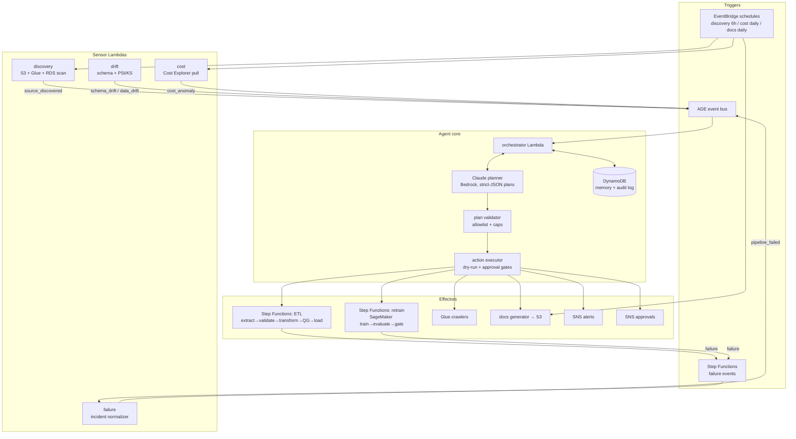

# ADE — System Architecture

ADE (Autonomous Data Engineer) is an event-driven agent that operates an AWS
data platform: it discovers sources, builds and runs ETL pipelines, detects
schema and data drift, retrains models, watches production, optimizes cost,
keeps documentation current, and heals failures — escalating to humans when
its guardrails say it must.

## Design principles

1. **The LLM proposes; deterministic code disposes.** Claude (on Amazon
   Bedrock) produces plans, but every plan is validated against a hard-coded
   action allowlist, capped in size, and destructive actions are always
   approval-gated — regardless of what the model says.
2. **Event-driven, stateless compute.** Everything is a Lambda triggered by
   EventBridge; durable state lives in DynamoDB; long-running work runs in
   Step Functions / SageMaker.
3. **Every decision is auditable.** Each plan and each action result is
   written to the `DECISION#` log in DynamoDB and emitted as CloudWatch
   metrics.
4. **Fail safe.** Dry-run by default, retry budgets with circuit breakers,
   an independent AWS Budgets backstop, and escalation as the terminal step
   of every remediation playbook.

## Component diagram



## The agent loop

```
event → load memory snapshot → circuit-breaker check
      → Claude plan (strict JSON schema, cached system prompt)
      → validate (allowlist, ≤5 actions, destructive ⇒ approval)
      → execute (dry-run aware)
      → record decision + remediation attempts → emit metrics
```

| Event type          | Produced by              | Typical plan                                            |
|---------------------|--------------------------|---------------------------------------------------------|
| `source_discovered` | discovery Lambda         | profile_dataset → build_etl_pipeline → generate_docs    |
| `schema_drift`      | drift Lambda             | additive: update_schema_registry; breaking: quarantine + alert |
| `data_drift`        | drift Lambda             | trigger_retraining (approval-gated) or alert            |
| `pipeline_failed`   | failure Lambda           | playbook step (retry/backfill/quarantine) or escalate   |
| `cost_anomaly`      | cost Lambda              | send_alert; apply_cost_recommendation (approval-gated)  |
| `model_evaluated`   | retrain state machine    | promote_model (approval-gated) or rollback_model        |

## Module map

| Concern              | Module                          | Key entry point                       |
|----------------------|---------------------------------|---------------------------------------|
| Agent loop           | `ade/agent/orchestrator.py`     | `Orchestrator.handle_event`           |
| Planning (LLM)       | `ade/agent/planner.py`, `ade/llm.py` | `plan_for_event`, `BedrockPlannerClient` |
| Guardrails           | `ade/agent/planner.py`          | `ACTION_CATALOG`, `validate_plan`     |
| Action execution     | `ade/agent/actions.py`          | `ActionExecutor.execute`              |
| Memory / audit       | `ade/agent/memory.py`           | `DynamoMemoryStore`                   |
| Source discovery     | `ade/discovery/scanner.py`      | `SourceScanner`                       |
| Profiling            | `ade/discovery/profiler.py`     | `profile_rows`                        |
| ETL generation       | `ade/etl/pipeline_builder.py`   | `build_spec_from_profile`, `compile_to_asl` |
| Data quality         | `ade/etl/quality.py`            | `evaluate`, `split_failing_rows`      |
| Schema drift         | `ade/drift/schema_drift.py`     | `detect`                              |
| Data drift           | `ade/drift/data_drift.py`       | `population_stability_index`, `kolmogorov_smirnov` |
| Retraining policy    | `ade/ml/retraining.py`          | `decide_retrain`                      |
| Promotion gate       | `ade/ml/registry.py`            | `evaluate_promotion`                  |
| Cost optimization    | `ade/cost/optimizer.py`         | `detect_anomalies`, `recommend`       |
| Docs generation      | `ade/docsgen/generator.py`      | `render_catalog`                      |
| Self-healing         | `ade/recovery/self_healing.py`  | `classify`, `next_remediation`        |
| Monitoring           | `ade/monitoring/`               | `MetricsSink`, `Alerter`              |
| Lambda entrypoints   | `ade/lambdas/handlers.py`       | one handler per function              |

## Planner integration (Claude on Bedrock)

- Model: `anthropic.claude-opus-4-8` (Bedrock IDs carry the `anthropic.`
  prefix), adaptive thinking, `effort: high`.
- The system prompt (rules + action catalog) is frozen and marked with
  `cache_control` so repeat calls read it from the prompt cache (~90% input
  cost reduction); the volatile event + memory snapshot go in the user turn.
- The response is constrained to a JSON schema via `output_config.format`,
  so no free-text parsing exists anywhere in the loop.
- `validate_plan` is the trust boundary: unknown actions, oversized plans,
  or malformed params reject the entire plan and alert operators.

## Failure handling & recovery

- **Inside pipelines**: every Step Functions task retries with exponential
  backoff and catches to a Quarantine state; the quality gate blocks bad
  data from reaching curated storage.
- **Across pipelines**: failures become `pipeline_failed` incidents.
  `ade/recovery/self_healing.py` classifies the error (throttled, bad data,
  missing data, permissions, …) and selects the next playbook step.
- **Circuit breaker**: after `ADE_MAX_REMEDIATION_ATTEMPTS` (default 3) on
  one incident, the orchestrator stops planning and escalates directly.
- **Permissions failures never self-remediate** — the playbook is a single
  step: escalate. The agent must not attempt to modify IAM.

## Scaling notes

- Sensors and the orchestrator are stateless; concurrency is bounded only
  by Lambda limits and the planner's Bedrock TPS quota.
- DynamoDB on-demand handles the metadata workload; the planner snapshot is
  a bounded scan (≤500 items) to cap both latency and token cost.
- Heavy transforms can move from the worker Lambda to Glue by swapping the
  `Transform` state resource — the spec format is engine-agnostic.
